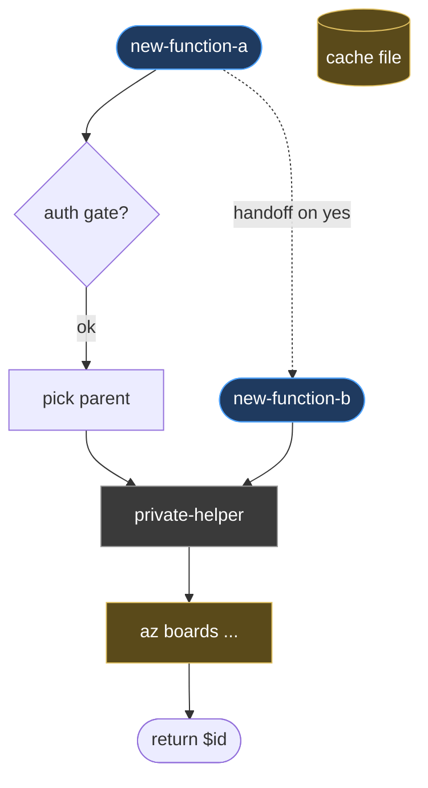

You generate a **per-PR mermaid flow diagram** that lives directly in the PR body. The goal: a reviewer landing on the PR sees, above the fold, a single picture of how the new code flows — entry points, key decision branches, side effects, hand-offs between new functions, return values.

This is **not** a substitute for `docs/azure-devops-diagrams.md` or any other long-form architecture doc. Those are full call graphs. The PR diagram is the *delta* — what this PR adds, drawn at a granularity that fits in ~12-18 nodes.

---

## When to run

- After the PR is created and the branch is in a settled state (no more functions about to be added or renamed)
- After `/pr-flow` has run, so the body's ToC is already in place — the diagram lands just below the ToC and just above `## Summary`
- Re-run idempotently any time the new-function set on the branch changes; the marker pair makes replacement clean

If the PR body already has a `<!-- pr-diagram:start -->` / `<!-- pr-diagram:end -->` block, replace it. Otherwise insert it.

---

## Step 1 — Detect PR

```bash
gh pr view --json number,url,body,headRefName,baseRefName 2>/dev/null
```

If no PR exists, stop and tell the user to create one first.

---

## Step 2 — Inventory the Branch's Net-New Functions

Compare the branch tip against the PR's base ref. Pull the set of **public** functions added (in this repo: anything matching the alias / cmdlet naming convention — bash `verb-noun`, PowerShell `Verb-Noun`).

```bash
BASE=$(gh pr view <number> --json baseRefName --jq '.baseRefName')
HEAD=$(gh pr view <number> --json headRefName --jq '.headRefName')

git fetch origin "$BASE" 2>/dev/null

# PowerShell new public functions
git diff "origin/$BASE...HEAD" -- 'powcuts_by_cli/*.ps1' \
  | grep -E "^\+function [A-Za-z][A-Za-z]*-[A-Za-z]" \
  | grep -v "^+++" \
  | sed -E 's/^\+function ([A-Za-z][A-Za-z]*-[A-Za-z][A-Za-z0-9-]*).*/\1/' \
  | sort -u

# Bash new public aliases / functions
git diff "origin/$BASE...HEAD" -- 'bashcuts_by_cli/*' \
  | grep -E "^\+(alias [a-z][a-z-]+=|[a-z][a-z-]+\(\))" \
  | grep -v "^+++" \
  | sed -E 's/^\+alias ([a-z][a-z-]+)=.*/\1/; s/^\+([a-z][a-z-]+)\(\).*/\1/' \
  | sort -u
```

Mark each function as **public** (no leading underscore, name appears in the README or matches the project's verb-noun convention) or **private helper** (everything else). Only public functions become root nodes in the diagram; private helpers are drawn as supporting nodes inside the flow when they're decision points or side-effect carriers.

---

## Step 3 — Extract the Flow

For each public function, read its body and identify:

| Element | Drawn as |
|---|---|
| Entry param block | Start node `Entry([func-name])` |
| Auth / precondition gate | Diamond `Gate{auth?}` with `→ abort` edge |
| Interactive prompt | Rounded rect `Pick(["pick X"])` |
| Internal helper invocation | Rect `Helper[priv-helper]` |
| `az` / external CLI call | Rect with `:::io` style `Cli["az boards ..."]` |
| Return value | Terminal `Done([return $id])` |
| Hand-off to another new function | Dotted edge `A -.handoff.-> B` |

**Cross-function chains:** if function A's flow ends with calling function B (also new in this PR), draw the dotted hand-off edge so the diagram reads as one connected story.

**Don't redraw the world.** If a public function calls a *pre-existing* helper (`Read-AzDevOpsHierarchyCache`, `Invoke-AzDevOpsAzJson`, etc.), reference it by name in a single node — don't expand its internals. The PR diagram is about what's new.

---

## Step 4 — Compose the Mermaid

Single `flowchart TD` block. Mirror the conventions in `docs/azure-devops-diagrams.md`:

- Public functions: `:::pub` class
- Private helpers: `:::priv` class
- External I/O (cache, az CLI, file system): `:::io` class
- Use `<br/>` for line breaks inside node labels
- Keep total node count ≤ 18; if the PR adds more functions than fit, group related helpers into a single labeled node ("Resolve area+iteration<br/>(picker + env-var fallback)")

Use this skeleton:

```markdown
## How it works


```

A one-paragraph prose lead-in **above** the diagram (one or two sentences) sets context: which entry points exist, what they accomplish, where they hand off. The diagram supports the prose, not the other way around.

---

## Step 5 — Insert / Replace in PR Body

Wrap the prose + diagram in idempotent markers:

```markdown
<!-- pr-diagram:start -->
## How it works

<one-paragraph lead-in>


<!-- pr-diagram:end -->
```

**Placement rules:**

1. If markers exist, replace the block in place.
2. If markers don't exist:
   - If the body has a `<!-- toc:end -->` marker, insert the new block on the line **after** it (so order is: ToC → How it works → Summary → ...).
   - Otherwise insert above the first `## Summary` heading.
   - If neither exists, prepend to the body.

Update the PR body via the GitHub MCP `update_pull_request` tool (use `mcp__github__update_pull_request`).

---

## Step 6 — Sanity Pass

After update:

- Re-fetch the PR body (`mcp__github__pull_request_read` with `method: get`).
- Confirm exactly one `<!-- pr-diagram:start -->` and one `<!-- pr-diagram:end -->` marker.
- Confirm the mermaid block opens with ```` ```mermaid ```` and closes with ```` ``` ````.
- Confirm node count is ≤ 18 (over-budget diagrams should have been collapsed in step 4).

---

## Step 7 — Report

```
## PR Diagram Updated — #<number>

### Functions Drawn
- Public: <list>
- Private (referenced as nodes): <list>
- Hand-off edges: <count>

### Diagram Stats
- Nodes: N
- External I/O nodes: M
- Block size: N lines of mermaid

### Next Steps
- If you renamed or removed functions later, re-run /pr-diagram to refresh
- For full architectural map, see `docs/azure-devops-diagrams.md`
```

---

## Notes

- **Don't substitute for the docs file.** `docs/azure-devops-diagrams.md` is the source of truth for the full subsystem. The PR diagram is reviewer-facing context for *this PR's delta only*.
- **Keep prose short.** One paragraph max above the diagram. Anything more belongs in the Summary or Changes sections.
- **Idempotency is mandatory.** A second run on the same branch must produce the same diagram (ignoring node ordering quirks); a run after new functions land must produce a diagram that reflects the new state and nothing more.
- **No emoji in node labels.** Mermaid renders them inconsistently across GitHub's mermaid versions; rely on shapes and the class palette for visual distinction.
