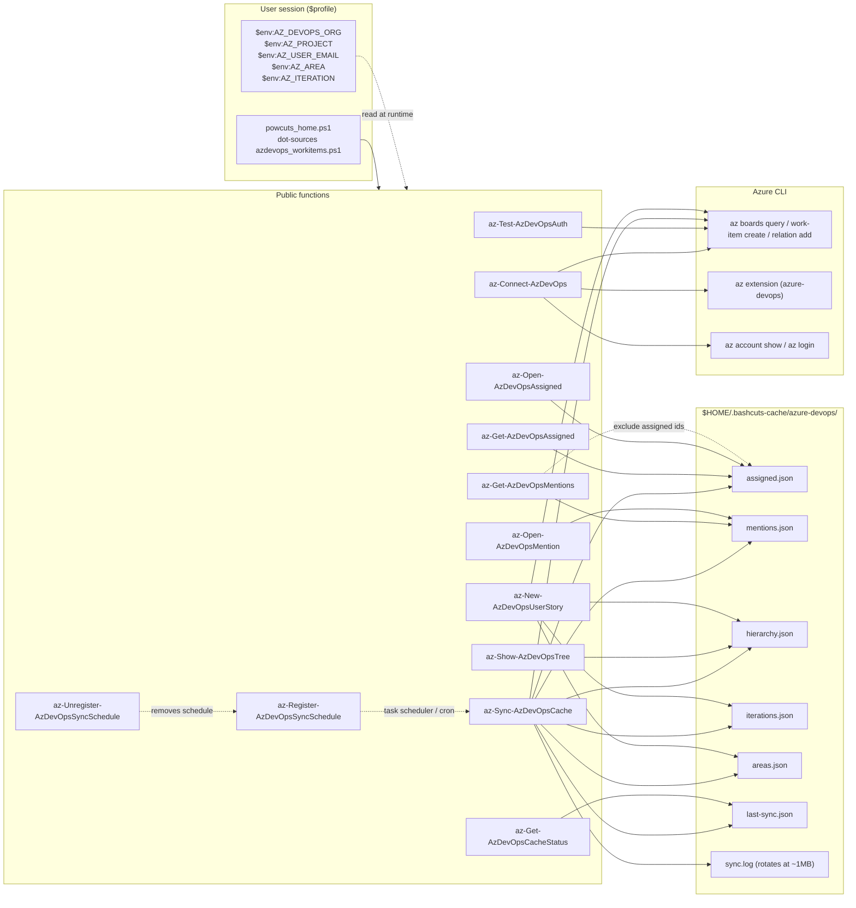
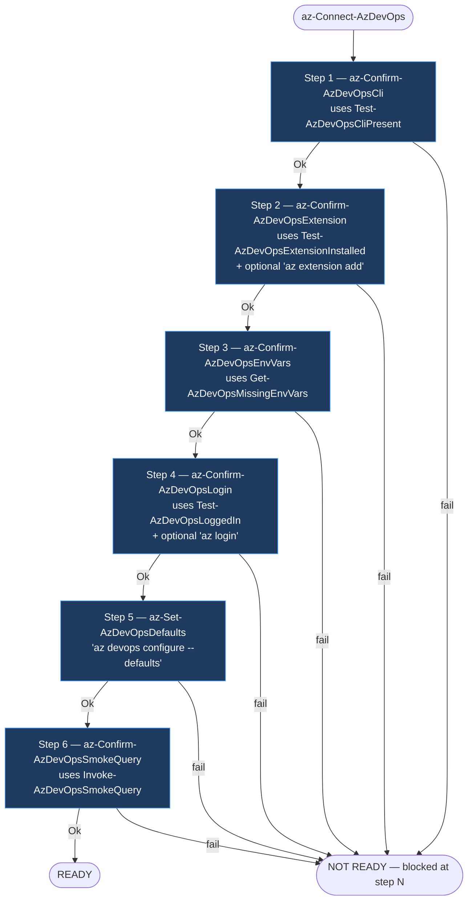
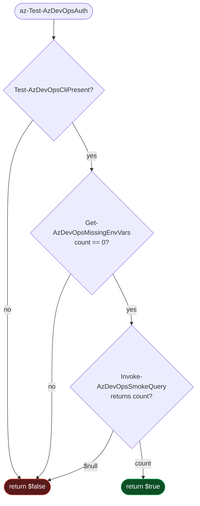
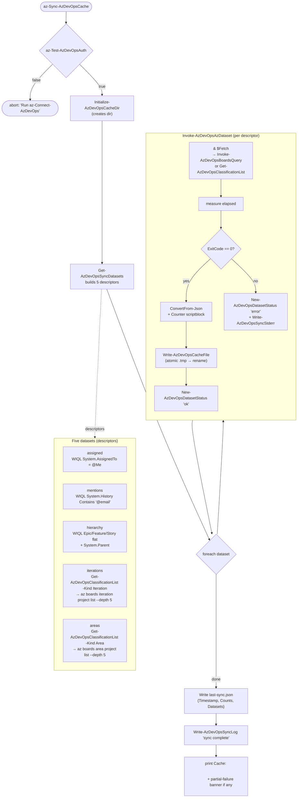
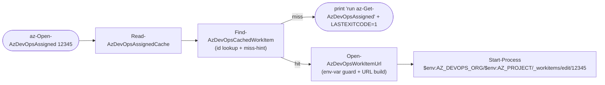
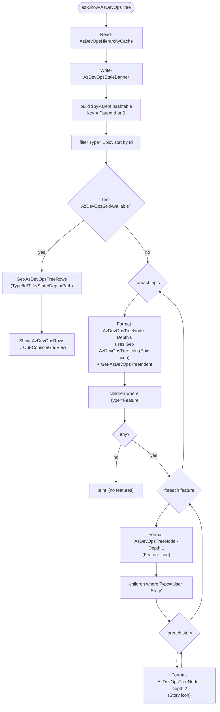
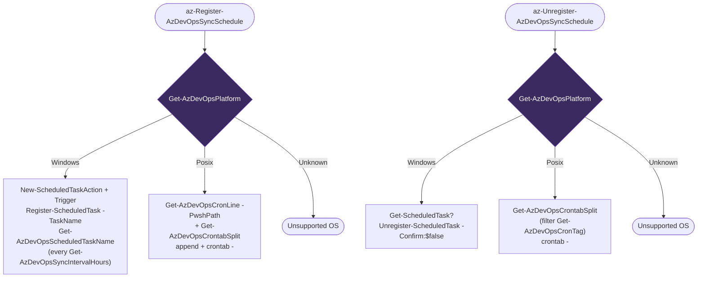

# Azure DevOps Functionality — Mermaid Diagrams

Visual reference for the Azure DevOps work-item shortcuts in `powcuts_by_cli/azdevops_workitems.ps1`. Each diagram covers one subsystem; the last diagram is a cross-cutting function-dependency map.

- [1. High-level architecture](#1-high-level-architecture)
- [2. `az-Connect-AzDevOps` — 6-step orchestrator](#2-az-connect-azdevops--6-step-orchestrator)
- [3. `az-Test-AzDevOpsAuth` — silent diagnostic chain](#3-az-test-azdevopsauth--silent-diagnostic-chain)
- [4. `az-Sync-AzDevOpsCache` — dataset fan-out](#4-az-sync-azdevopscache--dataset-fan-out)
- [5. Cache consumers (`az-Get-/az-Open-AzDevOps{Assigned,Mentions}`)](#5-cache-consumers-az-get-az-open-azdevopsassignedmentions)
- [6. `az-Show-AzDevOpsTree` — Epic → Feature → Story render](#6-az-show-azdevopstree--epic--feature--story-render)
- [7. `az-New-AzDevOpsUserStory` — interactive create flow](#7-az-new-azdevopsuserstory--interactive-create-flow)
- [8. `az-Register-/az-Unregister-AzDevOpsSyncSchedule` — platform branch](#8-az-register-az-unregister-azdevopssyncschedule--platform-branch)
- [9. Function dependency map](#9-function-dependency-map)

---

## 1. High-level architecture

How the public surface, the local cache, and the `az` CLI relate. Read-only consumers never touch `az` directly — they only read cache files.



---

## 2. `az-Connect-AzDevOps` — 6-step orchestrator

Thin orchestrator: a hard-coded array of step descriptors. Each step is a `Confirm-*` function that prints its own status and returns `{Ok, FailMessage}`. First failure short-circuits with `NOT READY`.



Helpers used by every step:

- `New-AzDevOpsStepResult` — builds the `{Ok, FailMessage}` PSCustomObject
- `Read-AzDevOpsYesNo` — default-yes Y/n prompt for remediation offers

---

## 3. `az-Test-AzDevOpsAuth` — silent diagnostic chain

Used by callers (`az-Sync-AzDevOpsCache`, `az-New-AzDevOpsUserStory`) at the top of every command to bail early if the environment regressed. No I/O — pure boolean.



Skipped on purpose: `Test-AzDevOpsExtensionInstalled` and `Test-AzDevOpsLoggedIn`. The smoke `az boards query` call already exercises both transitively, and a single failing query is faster + more authoritative than three individual probes.

---

## 4. `az-Sync-AzDevOpsCache` — dataset fan-out

Five datasets, one orchestrator. Each dataset descriptor declares its `Fetch` scriptblock, `Counter`, and target file path; `Invoke-AzDevOpsAzDataset` is the single sync helper that runs them all (per the CLAUDE.md extract-repeated-branches rule).



Atomic write pattern (`Write-AzDevOpsCacheFile`): `Set-Content` to `<path>.tmp`, then `Move-Item -Force` over the real path — partial files never replace good cache.

---

## 5. Cache consumers (`az-Get-/az-Open-AzDevOps{Assigned,Mentions}`)

The two parallel pairs share private helpers (extracted under "Shared scaffolding" per CLAUDE.md). They never call `az` — purely cache reads.

```mermaid
sequenceDiagram
    autonumber
    actor User
    participant GetA as az-Get-AzDevOpsAssigned
    participant ReadA as Read-AzDevOpsAssignedCache
    participant ReadJ as Read-AzDevOpsJsonCache
    participant Conv as ConvertFrom-AzDevOpsAssignedItem
    participant Banner as Write-AzDevOpsStaleBanner
    participant Filter as Select-AzDevOpsActiveItems
    participant Title as Format-AzDevOpsTruncatedTitle
    participant Show as Show-AzDevOpsRows
    participant Cache as assigned.json

    User->>GetA: az-Get-AzDevOpsAssigned -State Active
    GetA->>ReadA: ReadAssigned()
    ReadA->>ReadJ: Read-AzDevOpsJsonCache(path, converter)
    ReadJ->>Cache: Get-Content -Raw
    Cache-->>ReadJ: JSON
    ReadJ->>Conv: per-row converter
    Conv-->>ReadJ: PSCustomObject[]
    ReadJ-->>ReadA: items
    ReadA-->>GetA: items

    GetA->>Banner: WARNING stale (if last-sync > 6h)
    GetA->>Filter: filter by -State or active default
    Filter-->>GetA: filtered[]
    GetA->>Title: title-column projection
    Title-->>GetA: rows
    GetA->>Show: -PassThru (Out-ConsoleGridView<br/>or Format-Table fallback)
    Show-->>User: selected rows / rendered table
```

Open-by-id flow re-uses the same cache + a different last-mile helper:



`az-Open-AzDevOpsMention` is structurally identical, just swaps `Read-AzDevOpsMentionsCache` and the `-Description 'mentions'` label.

---

## 6. `az-Show-AzDevOpsTree` — Epic → Feature → Story render

Pure cache read, no `az`. The hierarchy WIQL pulled `[System.Parent]` per row, so a single pass into a `byParent` hashtable is enough — no follow-up queries.



Icon helper `Get-AzDevOpsTreeIcon` returns named codepoint locals (`$iconEpic`, `$iconFeature`, `$iconStory`) — never raw `[char]0x...` literals at the call site.

---

## 7. `az-New-AzDevOpsUserStory` — interactive create flow

Interactive walk-through with all-optional parameters: every prompt is skipped if its parameter was supplied, so the function is also script-callable.

```mermaid
flowchart TD
    Start([az-New-AzDevOpsUserStory]) --> Auth{az-Test-AzDevOpsAuth}
    Auth -- false --> Abort1([abort: 'Run az-Connect-AzDevOps'])
    Auth -- true --> Email{$env:AZ_USER_EMAIL set?}
    Email -- no --> Abort2([abort])
    Email -- yes --> Hier[Read-AzDevOpsHierarchyCache]
    Hier -- null --> Abort3([abort: cache missing])
    Hier -- ok --> Title{Title param?}

    Title -- no --> ReadTitle["Read-Host 'title'"]
    Title -- yes --> Desc{Description param?}
    ReadTitle --> TitleEmpty{empty?}
    TitleEmpty -- yes --> Abort4([abort])
    TitleEmpty -- no --> Desc

    Desc -- no --> ReadDesc["Read-Host 'description'"]
    Desc -- yes --> Prio{Priority 1-4?}
    ReadDesc --> Prio
    Prio -- no --> ReadPrio[Read-AzDevOpsPriority]
    Prio -- yes --> SP{StoryPoints >=0?}
    ReadPrio --> SP
    SP -- no --> ReadSP[Read-AzDevOpsStoryPoints]
    SP -- yes --> AC{AC param?}
    ReadSP --> AC
    AC -- no --> ReadAC[Read-AzDevOpsAcceptanceCriteria]
    AC -- yes --> Feat{FeatureId >=0?}
    ReadAC --> Feat
    Feat -- no --> PickFeat["Read-AzDevOpsFeaturePick<br/>(active Features from hierarchy.json)<br/>→ Read-AzDevOpsGridPick (Out-ConsoleGridView)<br/>or numbered menu fallback"]
    Feat -- yes --> Iter{Iteration param?}
    PickFeat --> Iter
    Iter -- no --> PickIter["Read-AzDevOpsKindPick -Kind 'Iteration'<br/>cache or Invoke-AzDevOpsClassificationLive<br/>→ Read-AzDevOpsGridPick (Out-ConsoleGridView)"]
    Iter -- yes --> Area{Area param?}
    PickIter --> Area
    Area -- no --> PickArea["Read-AzDevOpsKindPick -Kind 'Area'<br/>→ Read-AzDevOpsGridPick (Out-ConsoleGridView)"]
    Area -- yes --> Create
    PickArea --> Create

    Create["Invoke-AzDevOpsWorkItemCreate<br/>→ New-AzDevOpsWorkItem<br/>→ az boards work-item create"]
    Create --> CreateOk{Ok?}
    CreateOk -- no --> CreateFail([STEP FAILED])
    CreateOk -- yes --> Link{FeatureId > 0?}
    Link -- yes --> InvokeLink["Invoke-AzDevOpsParentLink<br/>→ Add-AzDevOpsWorkItemRelation<br/>→ az boards work-item relation add"]
    InvokeLink --> Open
    Link -- no --> Orphan["print '(no parent linked)'"]
    Orphan --> Open
    Open{NoOpen switch?}
    Open -- no --> SP2["Start-Process $newUrl"]
    Open -- yes --> Done
    SP2 --> Done([return $newId])
```



Picker fallback: if `iterations.json` / `areas.json` aren't in the cache yet (user upgraded but hasn't synced), `Read-AzDevOpsKindPick` calls `Invoke-AzDevOpsClassificationLive` and prints a one-line "(run az-Sync-AzDevOpsCache to make this instant)" hint.

---

## 8. `az-Register-/az-Unregister-AzDevOpsSyncSchedule` — platform branch

Both functions delegate the OS check to `Get-AzDevOpsPlatform` so the branch lives in one place. The cron line itself is built by `Get-AzDevOpsCronLine` (also reused) so register and unregister stay symmetric.



Shared private helpers (named in CLAUDE.md):

- `Get-AzDevOpsPlatform` → `'Windows' | 'Posix' | 'Unknown'`
- `Get-AzDevOpsScheduledTaskName` → `'BashcutsAzDevOpsSync'`
- `Get-AzDevOpsSyncIntervalHours` → `5`
- `Get-AzDevOpsCronTag` → `'# bashcuts-azdevops-sync'`
- `Get-AzDevOpsCronLine -PwshPath` → assembled cron line
- `Get-AzDevOpsCrontabSplit` → `{Other, HadBashcuts}` partition

---

## 9. Function dependency map

Public functions on the left, private helpers on the right. Helpers under "Shared scaffolding" exist specifically because their bodies were duplicated across the parallel `Get-/Open-` pairs and the parallel `Register-/Unregister-` pairs.

```mermaid
graph LR
    classDef pub fill:#1f3a5f,stroke:#4ea3ff,color:#fff
    classDef priv fill:#3a3a3a,stroke:#888,color:#ddd
    classDef io fill:#5a3a1a,stroke:#ffaa55,color:#fff

    Connect(["az-Connect-AzDevOps"]):::pub
    TestAuth(["az-Test-AzDevOpsAuth"]):::pub
    Sync(["az-Sync-AzDevOpsCache"]):::pub
    Status(["az-Get-AzDevOpsCacheStatus"]):::pub
    Reg(["az-Register-AzDevOpsSyncSchedule"]):::pub
    Unreg(["az-Unregister-AzDevOpsSyncSchedule"]):::pub
    GetA(["az-Get-AzDevOpsAssigned"]):::pub
    OpenA(["az-Open-AzDevOpsAssigned"]):::pub
    GetM(["az-Get-AzDevOpsMentions"]):::pub
    OpenM(["az-Open-AzDevOpsMention"]):::pub
    Tree(["az-Show-AzDevOpsTree"]):::pub
    NewS(["az-New-AzDevOpsUserStory"]):::pub

    %% Step helpers
    C1[az-Confirm-AzDevOpsCli]:::priv
    C2[az-Confirm-AzDevOpsExtension]:::priv
    C3[az-Confirm-AzDevOpsEnvVars]:::priv
    C4[az-Confirm-AzDevOpsLogin]:::priv
    C5[az-Set-AzDevOpsDefaults]:::priv
    C6[az-Confirm-AzDevOpsSmokeQuery]:::priv
    StepRes[New-AzDevOpsStepResult]:::priv
    YN[Read-AzDevOpsYesNo]:::priv

    %% Diagnostic helpers
    TCli[Test-AzDevOpsCliPresent]:::priv
    TExt[Test-AzDevOpsExtensionInstalled]:::priv
    TEnv[Get-AzDevOpsMissingEnvVars]:::priv
    TLog[Test-AzDevOpsLoggedIn]:::priv
    TSmoke[Invoke-AzDevOpsSmokeQuery]:::priv

    %% Cache infra
    Paths[Get-AzDevOpsCachePaths]:::priv
    InitDir[Initialize-AzDevOpsCacheDir]:::priv
    WriteFile[Write-AzDevOpsCacheFile]:::priv
    LogFn[Write-AzDevOpsSyncLog]:::priv
    Age[Get-AzDevOpsCacheAge]:::priv

    %% Sync helpers
    DSets[Get-AzDevOpsSyncDatasets]:::priv
    InvokeDS[Invoke-AzDevOpsAzDataset]:::priv
    Stderr1[Get-AzDevOpsFirstStderrLine]:::priv
    DStatus[New-AzDevOpsDatasetStatus]:::priv
    StderrW[Write-AzDevOpsSyncStderr]:::priv
    Measure[Measure-AzDevOpsClassificationNodes]:::priv

    %% Data-plane wrappers (azdevops_db.ps1)
    AzJson[Invoke-AzDevOpsAzJson]:::priv
    Boards[Invoke-AzDevOpsBoardsQuery]:::priv
    ClassList[Get-AzDevOpsClassificationList]:::priv
    NewWI[New-AzDevOpsWorkItem]:::priv
    AddRel[Add-AzDevOpsWorkItemRelation]:::priv

    %% Schedule helpers
    Plat[Get-AzDevOpsPlatform]:::priv
    TaskName[Get-AzDevOpsScheduledTaskName]:::priv
    Interval[Get-AzDevOpsSyncIntervalHours]:::priv
    CronTag[Get-AzDevOpsCronTag]:::priv
    CronLine[Get-AzDevOpsCronLine]:::priv
    CronSplit[Get-AzDevOpsCrontabSplit]:::priv

    %% Read helpers
    ReadJson[Read-AzDevOpsJsonCache]:::priv
    ConvA[ConvertFrom-AzDevOpsAssignedItem]:::priv
    ConvM[ConvertFrom-AzDevOpsMentionItem]:::priv
    ConvH[ConvertFrom-AzDevOpsHierarchyItem]:::priv
    ReadA[Read-AzDevOpsAssignedCache]:::priv
    ReadM[Read-AzDevOpsMentionsCache]:::priv
    ReadH[Read-AzDevOpsHierarchyCache]:::priv

    %% Shared scaffolding
    Closed[Get-AzDevOpsClosedStates]:::priv
    Stale[Write-AzDevOpsStaleBanner]:::priv
    SelAct[Select-AzDevOpsActiveItems]:::priv
    Trunc[Format-AzDevOpsTruncatedTitle]:::priv
    TitleCol[Get-AzDevOpsTitleColumn]:::priv
    Find[Find-AzDevOpsCachedWorkItem]:::priv
    OpenUrl[Open-AzDevOpsWorkItemUrl]:::priv
    MentDN[Get-AzDevOpsMentionedByDisplayName]:::priv

    %% Tree helpers
    Indent[Get-AzDevOpsTreeIndent]:::priv
    Icon[Get-AzDevOpsTreeIcon]:::priv
    NodeFmt[Format-AzDevOpsTreeNode]:::priv
    TreeRows[Get-AzDevOpsTreeRows]:::priv

    %% Grid presentation helpers (Out-ConsoleGridView)
    GridAvail[Test-AzDevOpsGridAvailable]:::priv
    ShowRows[Show-AzDevOpsRows]:::priv
    GridPick[Read-AzDevOpsGridPick]:::priv
    StatusRows[Get-AzDevOpsCacheStatusRows]:::priv

    %% NewStory helpers
    ReadCls[Read-AzDevOpsClassificationCache]:::priv
    InvCls[Invoke-AzDevOpsClassificationLive]:::priv
    ToWIPath[ConvertTo-AzDevOpsWorkItemPath]:::priv
    ToCPaths[ConvertTo-AzDevOpsClassificationPaths]:::priv
    GetCPaths[Get-AzDevOpsClassificationPaths]:::priv
    Pri[Read-AzDevOpsPriority]:::priv
    Pts[Read-AzDevOpsStoryPoints]:::priv
    AC[Read-AzDevOpsAcceptanceCriteria]:::priv
    PFeat[Read-AzDevOpsFeaturePick]:::priv
    PCls[Read-AzDevOpsClassificationPick]:::priv
    PKind[Read-AzDevOpsKindPick]:::priv
    InvCreate[Invoke-AzDevOpsWorkItemCreate]:::priv
    InvLink[Invoke-AzDevOpsParentLink]:::priv

    %% I/O sinks
    Az[(az CLI)]:::io
    FS[(cache files)]:::io

    Connect --> C1 --> TCli
    Connect --> C2 --> TExt
    Connect --> C3 --> TEnv
    Connect --> C4 --> TLog
    Connect --> C5
    Connect --> C6 --> TSmoke
    C1 & C2 & C3 & C4 & C5 & C6 --> StepRes
    C2 & C4 --> YN

    TestAuth --> TCli
    TestAuth --> TEnv
    TestAuth --> TSmoke
    TSmoke --> Az

    Sync --> TestAuth
    Sync --> InitDir --> Paths
    Sync --> LogFn --> Paths
    Sync --> DSets
    Sync --> InvokeDS
    InvokeDS --> Boards
    InvokeDS --> ClassList
    Boards --> AzJson
    ClassList --> AzJson
    AzJson --> Az
    InvokeDS --> Stderr1
    InvokeDS --> DStatus
    InvokeDS --> StderrW --> LogFn
    InvokeDS --> WriteFile --> FS
    DSets --> Measure

    Status --> Age --> Paths
    Status --> StatusRows --> ShowRows
    Reg --> Plat
    Reg --> TaskName
    Reg --> Interval
    Reg --> CronLine --> CronTag
    Reg --> CronSplit --> CronTag
    Unreg --> Plat
    Unreg --> TaskName
    Unreg --> CronSplit

    ReadA --> ReadJson --> Paths
    ReadA --> ConvA
    ReadM --> ReadJson
    ReadM --> ConvM --> MentDN
    ReadH --> ReadJson
    ReadH --> ConvH

    GetA --> ReadA
    GetA --> Stale --> Age
    GetA --> SelAct --> Closed
    GetA --> TitleCol --> Trunc
    GetA --> ShowRows
    OpenA --> ReadA
    OpenA --> Find
    OpenA --> OpenUrl --> Az

    GetM --> ReadM
    GetM --> ReadA
    GetM --> Stale
    GetM --> SelAct
    GetM --> TitleCol
    GetM --> ShowRows
    OpenM --> ReadM
    OpenM --> Find
    OpenM --> OpenUrl

    Tree --> ReadH
    Tree --> Stale
    Tree --> NodeFmt --> Indent
    NodeFmt --> Icon
    Tree --> TreeRows --> ShowRows
    ShowRows --> GridAvail
    GridPick --> GridAvail

    NewS --> TestAuth
    NewS --> ReadH
    NewS --> Pri
    NewS --> Pts
    NewS --> AC
    NewS --> PFeat
    NewS --> PKind --> ReadCls
    PKind --> InvCls --> ClassList
    ReadCls --> Paths
    PKind --> GetCPaths --> ToCPaths --> ToWIPath
    PFeat --> PCls
    PFeat --> GridPick
    PCls --> GridPick
    NewS --> InvCreate --> NewWI --> AzJson
    NewS --> InvLink --> AddRel --> AzJson
```



---

## How to render

GitHub renders mermaid in markdown natively — view this file on GitHub (or any markdown previewer with mermaid support, including VS Code with the Mermaid extension) to see the diagrams. No build step required.
