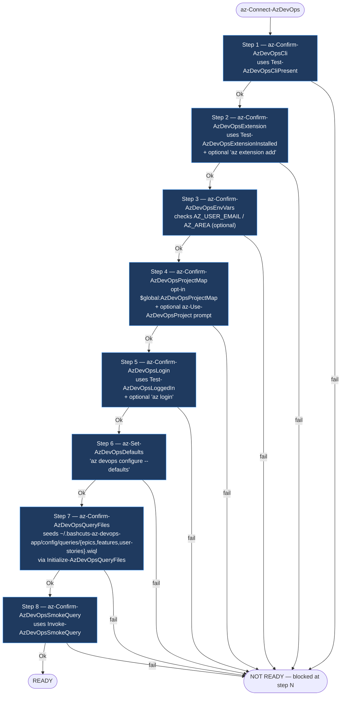
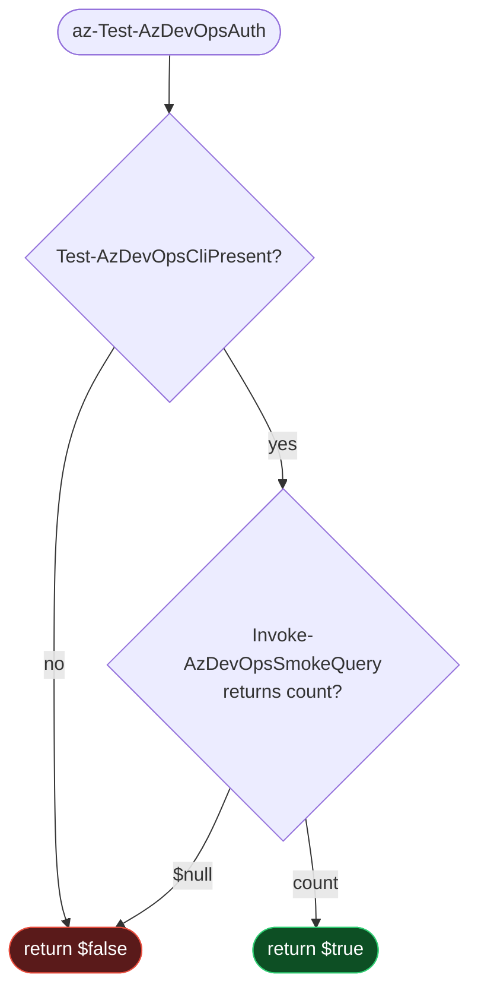
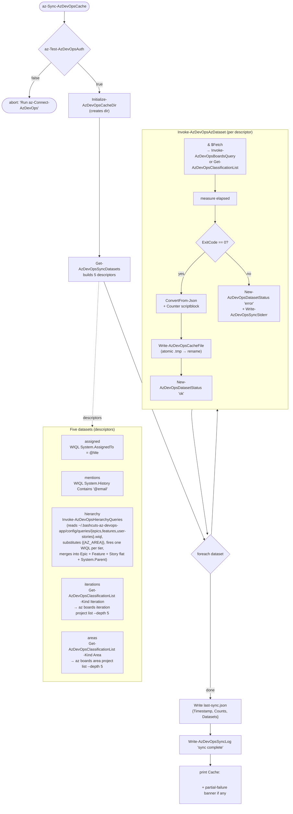
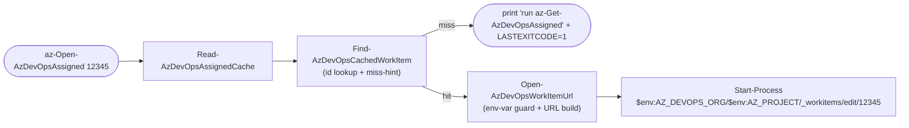
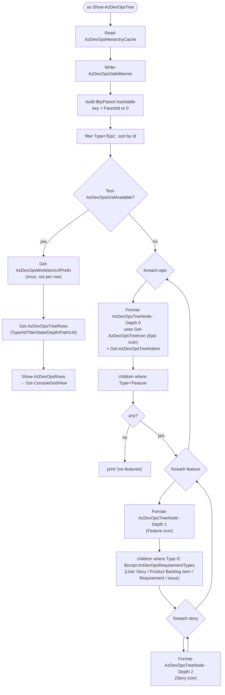

# Azure DevOps Functionality — Mermaid Diagrams

Visual reference for the Azure DevOps work-item shortcuts in `powcuts_by_cli/azdevops_workitems.ps1`. Each diagram covers one subsystem; the last diagram is a cross-cutting function-dependency map.

- [1. High-level architecture](#1-high-level-architecture)
- [2. `az-Connect-AzDevOps` — 8-step orchestrator](#2-az-connect-azdevops--8-step-orchestrator)
- [3. `az-Test-AzDevOpsAuth` — silent diagnostic chain](#3-az-test-azdevopsauth--silent-diagnostic-chain)
- [4. `az-Sync-AzDevOpsCache` — dataset fan-out](#4-az-sync-azdevopscache--dataset-fan-out)
- [5. Cache consumers (`az-Get-/az-Open-AzDevOps{Assigned,Mentions}`)](#5-cache-consumers-az-get-az-open-azdevopsassignedmentions)
- [6. `az-Show-AzDevOpsTree` — Epic → Feature → requirement-tier render](#6-az-show-azdevopstree--epic--feature--requirement-tier-render)
- [7. `az-New-AzDevOpsUserStory` — interactive create flow](#7-az-new-azdevopsuserstory--interactive-create-flow)
- [8. `az-New-AzDevOpsFeature` — interactive Feature create + child-story hand-off](#8-az-new-azdevopsfeature--interactive-feature-create--child-story-hand-off)
- [9. `az-New-AzDevOpsFeatureStories` — batch child-story loop](#9-az-new-azdevopsfeaturestories--batch-child-story-loop)
- [10. `az-Register-/az-Unregister-AzDevOpsSyncSchedule` — platform branch](#10-az-register-az-unregister-azdevopssyncschedule--platform-branch)
- [11. Function dependency map](#11-function-dependency-map)

---

## 1. High-level architecture

How the public surface, the local cache, and the `az` CLI relate. Read-only consumers never touch `az` directly — they only read cache files.

```mermaid
flowchart LR
    subgraph User["User session ($profile)"]
        Profile["powcuts_home.ps1<br/>dot-sources azdevops_workitems.ps1"]
        EnvVars["$env:AZ_DEVOPS_ORG<br/>$env:AZ_PROJECT<br/>$env:AZ_USER_EMAIL<br/>$env:AZ_AREA<br/>$env:AZ_ITERATION"]
    end

    subgraph Public["Public functions"]
        Connect["az-Connect-AzDevOps"]
        TestAuth["az-Test-AzDevOpsAuth"]
        Sync["az-Sync-AzDevOpsCache"]
        Status["az-Get-AzDevOpsCacheStatus"]
        Reg["az-Register-AzDevOpsSyncSchedule"]
        Unreg["az-Unregister-AzDevOpsSyncSchedule"]
        GetA["az-Get-AzDevOpsAssigned"]
        OpenA["az-Open-AzDevOpsAssigned"]
        GetM["az-Get-AzDevOpsMentions"]
        OpenM["az-Open-AzDevOpsMention"]
        Tree["az-Show-AzDevOpsTree"]
        Board["az-Show-AzDevOpsBoard"]
        ShowAreas["az-Show-AzDevOpsAreas"]
        ShowIters["az-Show-AzDevOpsIterations"]
        GetAreas["az-Get-AzDevOpsAreas"]
        GetIters["az-Get-AzDevOpsIterations"]
        Find["az-Find-AzDevOpsWorkItem"]
        FindArea["az-Find-AzDevOpsArea"]
        FindIter["az-Find-AzDevOpsIteration"]
        FindProj["az-Find-AzDevOpsProject"]
        NewStory["az-New-AzDevOpsUserStory"]
        NewFeat["az-New-AzDevOpsFeature"]
        NewStoryBatch["az-New-AzDevOpsFeatureStories"]
    end

    subgraph PathOpeners["Path inspectors (az-Open-AzDevOps*)"]
        OpensFolders["Folder openers:<br/>AppRoot, CacheDir, ConfigDir, SchemaDir"]
        OpensCache["Cache file openers:<br/>AssignedCache, MentionsCache, HierarchyCache,<br/>IterationsCache, AreasCache, LastSync, SyncLog"]
        OpensWiql["WIQL openers:<br/>EpicsWiql, FeaturesWiql, UserStoriesWiql"]
        OpensSchema["az-Open-AzDevOpsSchema"]
    end

    subgraph Cache["$HOME/.bashcuts-az-devops-app/cache/"]
        AssignedJson["assigned.json"]
        MentionsJson["mentions.json"]
        HierJson["hierarchy.json"]
        IterJson["iterations.json"]
        AreasJson["areas.json"]
        LastSync["last-sync.json"]
        SyncLog["sync.log (rotates at ~1MB)"]
    end

    subgraph Config["$HOME/.bashcuts-az-devops-app/config/queries/"]
        EpicsWiql["epics.wiql"]
        FeatsWiql["features.wiql"]
        StoriesWiql["user-stories.wiql"]
    end

    subgraph Schema["$HOME/.bashcuts-az-devops-app/schema/"]
        SchemaJson["schema-&lt;org&gt;.json"]
    end

    subgraph AzCLI["Azure CLI"]
        AzBoards["az boards query / work-item create / work-item update / relation add"]
        AzExt["az extension (azure-devops)"]
        AzAcct["az account show / az login"]
    end

    Profile --> Public
    EnvVars -.read at runtime.-> Public

    Connect --> AzAcct
    Connect --> AzExt
    Connect --> AzBoards
    TestAuth --> AzBoards

    Sync --> AzBoards
    Sync --> AssignedJson
    Sync --> MentionsJson
    Sync --> HierJson
    Sync --> IterJson
    Sync --> AreasJson
    Sync --> LastSync
    Sync --> SyncLog

    GetA --> AssignedJson
    OpenA --> AssignedJson
    GetM --> MentionsJson
    GetM -.exclude assigned ids.-> AssignedJson
    OpenM --> MentionsJson
    Tree --> HierJson
    Board --> HierJson
    Find --> HierJson
    Status --> LastSync

    ShowAreas --> AreasJson
    ShowAreas -.live fallback.-> AzBoards
    ShowIters --> IterJson
    ShowIters -.live fallback.-> AzBoards
    GetAreas --> AreasJson
    GetAreas -.live fallback.-> AzBoards
    GetIters --> IterJson
    GetIters -.live fallback.-> AzBoards
    FindArea --> AreasJson
    FindArea -.live fallback.-> AzBoards
    FindIter --> IterJson
    FindIter -.live fallback.-> AzBoards
    FindProj -.reads $global:AzDevOpsProjectMap.-> Public

    NewStory --> HierJson
    NewStory --> IterJson
    NewStory --> AreasJson
    NewStory --> AzBoards

    Reg -.task scheduler / cron.-> Sync
    Unreg -.removes schedule.-> Reg

    OpensFolders -.opens dir.-> Cache
    OpensFolders -.opens dir.-> Config
    OpensFolders -.opens dir.-> Schema
    OpensCache -.opens file.-> AssignedJson
    OpensCache -.opens file.-> MentionsJson
    OpensCache -.opens file.-> HierJson
    OpensCache -.opens file.-> IterJson
    OpensCache -.opens file.-> AreasJson
    OpensCache -.opens file.-> LastSync
    OpensCache -.opens file.-> SyncLog
    OpensWiql -.opens file.-> EpicsWiql
    OpensWiql -.opens file.-> FeatsWiql
    OpensWiql -.opens file.-> StoriesWiql
    OpensSchema -.opens file.-> SchemaJson

    Sync --> EpicsWiql
    Sync --> FeatsWiql
    Sync --> StoriesWiql
```



---

## 2. `az-Connect-AzDevOps` — 8-step orchestrator

Thin orchestrator: a hard-coded array of step descriptors. Each step is a `Confirm-*` function that prints its own status and returns `{Ok, FailMessage}`. First failure short-circuits with `NOT READY`. Step 4 (`az-Confirm-AzDevOpsProjectMap`) is opt-in: it returns `Ok=$true` immediately when `$global:AzDevOpsProjectMap` is not defined, so single-project users skip it transparently. Step 7 (`az-Confirm-AzDevOpsQueryFiles`) seeds the three user-machine WIQL files under `~/.bashcuts-az-devops-app/config/queries/` (`epics.wiql`, `features.wiql`, `user-stories.wiql`) so subsequent `az-Sync-AzDevOpsCache` runs can build the hierarchy from customizable per-tier queries rather than an inline string.



Helpers used by every step:

- `New-AzDevOpsStepResult` — builds the `{Ok, FailMessage}` PSCustomObject
- `Read-AzDevOpsYesNo` — default-yes Y/n prompt for remediation offers

---

## 3. `az-Test-AzDevOpsAuth` — silent diagnostic chain

Used by callers (`az-Sync-AzDevOpsCache`, `az-New-AzDevOpsUserStory`) at the top of every command to bail early if the environment regressed. No I/O — pure boolean.



Skipped on purpose: `Test-AzDevOpsExtensionInstalled` and `Test-AzDevOpsLoggedIn`. The smoke `az boards query` call already exercises both transitively, and a single failing query is faster + more authoritative than three individual probes.

---

## 4. `az-Sync-AzDevOpsCache` — dataset fan-out

Five datasets, one orchestrator. Each dataset descriptor declares its `Fetch` scriptblock, `Counter`, and target file path; `Invoke-AzDevOpsAzDataset` is the single sync helper that runs them all (per the CLAUDE.md extract-repeated-branches rule).



Atomic write pattern (`Write-AzDevOpsCacheFile`): `Set-Content` to `<path>.tmp`, then `Move-Item -Force` over the real path — partial files never replace good cache.

---

## 5. Cache consumers (`az-Get-/az-Open-AzDevOps{Assigned,Mentions}`)

The two parallel pairs share private helpers (extracted under "Shared scaffolding" per CLAUDE.md). They never call `az` — purely cache reads.

```mermaid
sequenceDiagram
    autonumber
    actor User
    participant GetA as az-Get-AzDevOpsAssigned
    participant ReadA as Read-AzDevOpsAssignedCache
    participant ReadJ as Read-AzDevOpsJsonCache
    participant Conv as ConvertFrom-AzDevOpsAssignedItem
    participant Banner as Write-AzDevOpsStaleBanner
    participant Filter as Select-AzDevOpsActiveItems
    participant Sort as Sort-AzDevOpsByDateDesc
    participant Title as Format-AzDevOpsTruncatedTitle
    participant Show as Show-AzDevOpsRows
    participant Cache as assigned.json

    User->>GetA: az-Get-AzDevOpsAssigned -State Active
    GetA->>ReadA: ReadAssigned()
    ReadA->>ReadJ: Read-AzDevOpsJsonCache(path, converter)
    ReadJ->>Cache: Get-Content -Raw
    Cache-->>ReadJ: JSON
    ReadJ->>Conv: per-row converter
    Conv-->>ReadJ: PSCustomObject[]
    ReadJ-->>ReadA: items
    ReadA-->>GetA: items

    GetA->>Banner: WARNING stale (if last-sync > 6h)
    GetA->>Filter: filter by -State or active default
    Filter-->>GetA: filtered[]
    GetA->>Sort: newest-first by AssignedAt (or MentionedAt)
    Sort-->>GetA: sorted[]
    GetA->>Title: title-column projection
    Title-->>GetA: rows
    GetA->>Show: -PassThru (Out-ConsoleGridView<br/>or Format-Table fallback)
    Show-->>User: selected rows / rendered table
```

Open-by-id flow re-uses the same cache + a different last-mile helper:



`az-Open-AzDevOpsMention` is structurally identical, just swaps `Read-AzDevOpsMentionsCache` and the `-Description 'mentions'` label.

---

## 6. `az-Show-AzDevOpsTree` — Epic → Feature → requirement-tier render

Pure cache read, no `az`. Each of the three hierarchy WIQLs (epics / features / user-stories) selects `[System.Parent]` per row, and `Invoke-AzDevOpsHierarchyQueries` merges them into a single flat array on disk, so a single pass into a `byParent` hashtable is enough — no follow-up queries.

The leaf-tier filter checks `Type -in $script:AzDevOpsRequirementTypes` — the four stock requirement-tier names across process templates (`User Story` on Agile, `Product Backlog Item` on Scrum, `Requirement` on CMMI, `Issue` on Basic) — so the same render code works on every template the user-stories WIQL fetches via `Microsoft.RequirementCategory`.



Icon helper `Get-AzDevOpsTreeIcon` returns named codepoint locals (`$iconEpic`, `$iconFeature`, `$iconStory`) — never raw `[char]0x...` literals at the call site.

---

## 7. `az-New-AzDevOpsUserStory` — interactive create flow

Interactive walk-through with all-optional parameters: every prompt is skipped if its parameter was supplied, so the function is also script-callable.


Picker fallback: if `iterations.json` / `areas.json` aren't in the cache yet (user upgraded but hasn't synced), `Read-AzDevOpsKindPick` calls `Invoke-AzDevOpsClassificationLive` and prints a one-line "(run az-Sync-AzDevOpsCache to make this instant)" hint.

---

## 8. `az-New-AzDevOpsFeature` — interactive Feature create + child-story hand-off

Tier-one-up counterpart to `az-New-AzDevOpsUserStory`. Picks a parent Epic from the cached hierarchy, fills `title / description / priority / area / iteration / AC`, creates the Feature, links to the Epic, then asks "Add child stories now?" — on yes hands off to `az-New-AzDevOpsFeatureStories -ParentId $newFeatureId` with the captured `area / iteration` pre-seeded. Story points are intentionally skipped (Features don't carry story points in default Agile / Scrum templates).

```mermaid
flowchart TD
    Start([az-New-AzDevOpsFeature]) --> Auth{az-Test-AzDevOpsAuth}
    Auth -- false --> Abort1([abort])
    Auth -- true --> Email{$env:AZ_USER_EMAIL set?}
    Email -- no --> Abort2([abort])
    Email -- yes --> Hier[Read-AzDevOpsHierarchyCache]
    Hier --> Title{Title param?}
    Title -- no --> ReadTitle["Read-Host 'title'"]
    Title -- yes --> Desc{Description param?}
    ReadTitle --> Desc
    Desc -- no --> ReadDesc["Read-Host 'description'"]
    Desc -- yes --> Prio{Priority 1-4?}
    ReadDesc --> Prio
    Prio -- no --> ReadPrio[Read-AzDevOpsPriority]
    Prio -- yes --> AC{AC param?}
    ReadPrio --> AC
    AC -- no --> ReadAC[Read-AzDevOpsAcceptanceCriteria]
    AC -- yes --> Epic{ParentEpicId >= 0?}
    ReadAC --> Epic
    Epic -- no --> PickEpic["Read-AzDevOpsEpicPick<br/>-> Read-AzDevOpsParentPick<br/>(active Epics from hierarchy.json)"]
    Epic -- yes --> Iter{Iteration param?}
    PickEpic --> Iter
    Iter -- no --> PickIter[Read-AzDevOpsKindPick -Kind 'Iteration']
    Iter -- yes --> Area{Area param?}
    PickIter --> Area
    Area -- no --> PickArea[Read-AzDevOpsKindPick -Kind 'Area']
    Area -- yes --> Create
    PickArea --> Create

    Create["Invoke-AzDevOpsWorkItemCreate -Type 'Feature'<br/>(StoryPoints field omitted)"]
    Create --> CreateOk{Ok?}
    CreateOk -- no --> CreateFail([STEP FAILED])
    CreateOk -- yes --> Link{ParentEpicId > 0?}
    Link -- yes --> InvokeLink["Invoke-AzDevOpsParentLink"]
    Link -- no --> Orphan["print '(orphan Feature)'"]
    InvokeLink --> Open
    Orphan --> Open
    Open{NoOpen switch?}
    Open -- no --> SP2["Start-Process $newUrl"]
    Open -- yes --> Handoff
    SP2 --> Handoff

    Handoff{NoChildStoriesPrompt?}
    Handoff -- yes --> Done
    Handoff -- no --> AskKids[Read-AzDevOpsYesNo 'Add child stories now?']
    AskKids -- no --> Done
    AskKids -- yes --> Loop["az-New-AzDevOpsFeatureStories -ParentId $newId<br/>-Iteration $Iteration -Area $Area"]
    Loop --> Done([return $newId])
```



DRY note: `Read-AzDevOpsEpicPick` and `Read-AzDevOpsFeaturePick` are 2-line wrappers over a shared `Read-AzDevOpsParentPick -ParentType 'Epic'|'Feature'` helper (per CLAUDE.md "extract repeated branches"). The single-shot story creator's parent picker did not regress — it still exists as `Read-AzDevOpsFeaturePick`.

---

## 9. `az-New-AzDevOpsFeatureStories` — batch child-story loop

Batch counterpart to `az-New-AzDevOpsUserStory`. Captures parent / area / iteration **once** at the top, then loops per-story prompts (title, AC, priority, story points) until the user submits an empty title or answers `n` to "Add another?". Mid-batch failures don't abort. Each child create runs through the same `Invoke-AzDevOpsWorkItemCreate` + `Invoke-AzDevOpsParentLink` pair the single-shot creator uses, so failure modes / schema enforcement stay identical.

```mermaid
flowchart TD
    Start([az-New-AzDevOpsFeatureStories -ParentId N]) --> Auth{az-Test-AzDevOpsAuth}
    Auth -- false --> Abort1([abort: 'Run az-Connect-AzDevOps'])
    Auth -- true --> Email{$env:AZ_USER_EMAIL set?}
    Email -- no --> Abort2([abort])
    Email -- yes --> Hier[Read-AzDevOpsHierarchyCache]
    Hier -- null --> Abort3([abort: cache missing])
    Hier -- ok --> Validate[Test-AzDevOpsParentIsFeature]
    Validate -- not-found / not-Feature --> Abort4([abort: clear message])
    Validate -- ok --> PickIter["Read-AzDevOpsKindPick -Kind 'Iteration'<br/>(skipped if -Iteration param)"]
    PickIter --> PickArea["Read-AzDevOpsKindPick -Kind 'Area'<br/>(skipped if -Area param)"]
    PickArea --> Loop

    Loop[Story loop iteration N] --> ReadTitle["Read-Host 'Story title (Enter to finish batch)'"]
    ReadTitle --> EmptyTitle{empty?}
    EmptyTitle -- yes --> Summary
    EmptyTitle -- no --> ReadAC[Read-AzDevOpsAcceptanceCriteria]
    ReadAC --> ReadPrio["Read-AzDevOpsPriority -Previous $previousPriority<br/>(Enter reuses last answer)"]
    ReadPrio --> ReadSP["Read-AzDevOpsStoryPoints -Previous $previousStoryPoints"]
    ReadSP --> Create["Invoke-AzDevOpsWorkItemCreate<br/>+ Invoke-AzDevOpsParentLink"]
    Create --> CreateOk{Ok?}
    CreateOk -- no --> FailCount["fail counter ++<br/>title -> failedTitles"]
    CreateOk -- yes --> CarryFwd["createdIds += newId<br/>previousPriority / previousStoryPoints = answers"]
    FailCount --> Continue
    CarryFwd --> Continue
    Continue[Read-AzDevOpsBatchContinue] --> Decide{stop / continue / change?}
    Decide -- stop --> Summary
    Decide -- continue --> Loop
    Decide -- change --> Repick["Read-AzDevOpsKindPick -Kind 'Iteration'<br/>Read-AzDevOpsKindPick -Kind 'Area'<br/>(carried forward into the next story)"]
    Repick --> Loop

    Summary["one-line summary:<br/>'Created N child stories under Feature #P: id1, id2, ...'<br/>(or 'Created N, Failed M' on partial failure)"]
    Summary --> Urls[one URL per created story]
    Urls --> Done([return [int[]] $createdIds])
```

Helpers introduced for this flow (named in CLAUDE.md's "extract repeated branches" + "name your magic strings" rules):

- `Get-AzDevOpsReuseHint` — formats the `(Enter to reuse '<value>')` suffix; reused by `Read-AzDevOpsPriority` + `Read-AzDevOpsStoryPoints`.
- `Read-AzDevOpsBatchContinue` — three-way `y/N/c` loop-control prompt.
- `Test-AzDevOpsParentIsFeature` — pre-loop validation against `hierarchy.json`.

---

## 10. `az-Register-/az-Unregister-AzDevOpsSyncSchedule` — platform branch

Both functions delegate the OS check to `Get-AzDevOpsPlatform` so the branch lives in one place. The cron line itself is built by `Get-AzDevOpsCronLine` (also reused) so register and unregister stay symmetric.


Shared private helpers (named in CLAUDE.md):

- `Get-AzDevOpsPlatform` → `'Windows' | 'Posix' | 'Unknown'`
- `Get-AzDevOpsScheduledTaskName` → `'BashcutsAzDevOpsSync'`
- `Get-AzDevOpsSyncIntervalHours` → `5`
- `Get-AzDevOpsCronTag` → `'# bashcuts-azdevops-sync'`
- `Get-AzDevOpsCronLine -PwshPath` → assembled cron line
- `Get-AzDevOpsCrontabSplit` → `{Other, HadBashcuts}` partition

---

## 11. Function dependency map

Public functions on the left, private helpers on the right. Helpers under "Shared scaffolding" exist specifically because their bodies were duplicated across the parallel `Get-/Open-` pairs and the parallel `Register-/Unregister-` pairs. The "Multi-project resolver layer" cluster collects the opt-in `$global:AzDevOpsProjectMap` switcher (`az-Use-/Show-/Get-AzDevOpsProject(s)`) plus every `Resolve-AzDevOpsType*` helper consumed by the `az-New-*` creators; when no map is defined, all resolvers return `$null`/`-1`/`@()` and the create paths fall through to today's prompt-driven flow.

```mermaid
graph LR
    classDef pub fill:#1f3a5f,stroke:#4ea3ff,color:#fff
    classDef priv fill:#3a3a3a,stroke:#888,color:#ddd
    classDef io fill:#5a3a1a,stroke:#ffaa55,color:#fff

    Connect(["az-Connect-AzDevOps"]):::pub
    TestAuth(["az-Test-AzDevOpsAuth"]):::pub
    Sync(["az-Sync-AzDevOpsCache"]):::pub
    Status(["az-Get-AzDevOpsCacheStatus"]):::pub
    Reg(["az-Register-AzDevOpsSyncSchedule"]):::pub
    Unreg(["az-Unregister-AzDevOpsSyncSchedule"]):::pub
    GetA(["az-Get-AzDevOpsAssigned"]):::pub
    OpenA(["az-Open-AzDevOpsAssigned"]):::pub
    GetM(["az-Get-AzDevOpsMentions"]):::pub
    OpenM(["az-Open-AzDevOpsMention"]):::pub
    Tree(["az-Show-AzDevOpsTree"]):::pub
    Board(["az-Show-AzDevOpsBoard"]):::pub
    ShowAreas(["az-Show-AzDevOpsAreas"]):::pub
    ShowIters(["az-Show-AzDevOpsIterations"]):::pub
    GetAreas(["az-Get-AzDevOpsAreas"]):::pub
    GetIters(["az-Get-AzDevOpsIterations"]):::pub
    FindArea(["az-Find-AzDevOpsArea"]):::pub
    FindIter(["az-Find-AzDevOpsIteration"]):::pub
    NewS(["az-New-AzDevOpsUserStory"]):::pub
    NewF(["az-New-AzDevOpsFeature"]):::pub
    NewSB(["az-New-AzDevOpsFeatureStories"]):::pub
    Find(["az-Find-AzDevOpsWorkItem"]):::pub
    OpenHWiql(["az-Open-AzDevOpsHierarchyWiqls"]):::pub

    %% Multi-project switcher (azdevops_projects.ps1)
    UseProj(["az-Use-AzDevOpsProject"]):::pub
    ShowProj(["az-Show-AzDevOpsProject"]):::pub
    GetProjs(["az-Get-AzDevOpsProjects"]):::pub
    FindProj(["az-Find-AzDevOpsProject"]):::pub

    %% Step helpers
    C1[az-Confirm-AzDevOpsCli]:::priv
    C2[az-Confirm-AzDevOpsExtension]:::priv
    C3[az-Confirm-AzDevOpsEnvVars]:::priv
    CMap[az-Confirm-AzDevOpsProjectMap]:::priv
    C4[az-Confirm-AzDevOpsLogin]:::priv
    C5[az-Set-AzDevOpsDefaults]:::priv
    C6[az-Confirm-AzDevOpsSmokeQuery]:::priv
    C7[az-Confirm-AzDevOpsQueryFiles]:::priv
    StepRes[New-AzDevOpsStepResult]:::priv
    YN[Read-AzDevOpsYesNo]:::priv

    %% Diagnostic helpers
    TCli[Test-AzDevOpsCliPresent]:::priv
    TExt[Test-AzDevOpsExtensionInstalled]:::priv
    TLog[Test-AzDevOpsLoggedIn]:::priv
    TSmoke[Invoke-AzDevOpsSmokeQuery]:::priv

    %% Cache infra
    Paths[Get-AzDevOpsCachePaths]:::priv
    InitDir[Initialize-AzDevOpsCacheDir]:::priv
    WriteFile[Write-AzDevOpsCacheFile]:::priv
    LogFn[Write-AzDevOpsSyncLog]:::priv
    Age[Get-AzDevOpsCacheAge]:::priv

    %% Sync helpers
    DSets[Get-AzDevOpsSyncDatasets]:::priv
    InvokeDS[Invoke-AzDevOpsAzDataset]:::priv
    Stderr1[Get-AzDevOpsFirstStderrLine]:::priv
    DStatus[New-AzDevOpsDatasetStatus]:::priv
    StderrW[Write-AzDevOpsSyncStderr]:::priv
    Measure[Measure-AzDevOpsClassificationNodes]:::priv

    %% Query config (azdevops_workitems.ps1)
    QPaths[Get-AzDevOpsConfigPaths]:::priv
    QInit[Initialize-AzDevOpsQueryFiles]:::priv
    QWiql[Get-AzDevOpsWiql]:::priv
    QDefaults[Get-AzDevOpsQueryDefaults]:::priv
    QNames[Get-AzDevOpsHierarchyQueryNames]:::priv
    InvHier[Invoke-AzDevOpsHierarchyQueries]:::priv
    MkDir[New-AzDevOpsDirectoryIfMissing]:::priv

    %% Data-plane wrappers (azdevops_db.ps1)
    GetConf[Get-AzDevOpsConfiguredDefaults]:::priv
    AzJson[Invoke-AzDevOpsAzJson]:::priv
    Boards[Invoke-AzDevOpsBoardsQuery]:::priv
    ClassList[Get-AzDevOpsClassificationList]:::priv
    NewWI[New-AzDevOpsWorkItem]:::priv
    AddRel[Add-AzDevOpsWorkItemRelation]:::priv
    AddDisc[Add-AzDevOpsDiscussionComment]:::priv
    WITypeDef[Get-AzDevOpsWorkItemTypeDefinition]:::priv

    %% Query echo helpers (azdevops_db.ps1)
    CmdDisp[Format-AzDevOpsCommandDisplay]:::priv
    CmdHead[Get-AzDevOpsCommandHeadline]:::priv
    EchoLn[Write-AzDevOpsQueryEcho]:::priv

    %% Schedule helpers
    Plat[Get-AzDevOpsPlatform]:::priv
    TaskName[Get-AzDevOpsScheduledTaskName]:::priv
    Interval[Get-AzDevOpsSyncIntervalHours]:::priv
    CronTag[Get-AzDevOpsCronTag]:::priv
    CronLine[Get-AzDevOpsCronLine]:::priv
    CronSplit[Get-AzDevOpsCrontabSplit]:::priv

    %% Read helpers
    ReadJson[Read-AzDevOpsJsonCache]:::priv
    ConvA[ConvertFrom-AzDevOpsAssignedItem]:::priv
    ConvM[ConvertFrom-AzDevOpsMentionItem]:::priv
    ConvH[ConvertFrom-AzDevOpsHierarchyItem]:::priv
    ReadA[Read-AzDevOpsAssignedCache]:::priv
    ReadM[Read-AzDevOpsMentionsCache]:::priv
    ReadH[Read-AzDevOpsHierarchyCache]:::priv

    %% Shared scaffolding
    Closed[Get-AzDevOpsClosedStates]:::priv
    Stale[Write-AzDevOpsStaleBanner]:::priv
    SelAct[Select-AzDevOpsActiveItems]:::priv
    Sort[Sort-AzDevOpsByDateDesc]:::priv
    Trunc[Format-AzDevOpsTruncatedTitle]:::priv
    TitleCol[Get-AzDevOpsTitleColumn]:::priv
    Find[Find-AzDevOpsCachedWorkItem]:::priv
    OpenUrl[Open-AzDevOpsWorkItemUrl]:::priv
    WiUrl[Get-AzDevOpsWorkItemUrl]:::priv
    WiPfx[Get-AzDevOpsWorkItemUrlPrefix]:::priv
    MentDN[Get-AzDevOpsMentionedByDisplayName]:::priv

    %% Tree helpers
    Indent[Get-AzDevOpsTreeIndent]:::priv
    Icon[Get-AzDevOpsTreeIcon]:::priv
    NodeFmt[Format-AzDevOpsTreeNode]:::priv
    TreeRows[Get-AzDevOpsTreeRows]:::priv

    %% Grid presentation helpers (Out-ConsoleGridView)
    GridAvail[Test-AzDevOpsGridAvailable]:::priv
    GridUnavail[Write-AzDevOpsGridUnavailable]:::priv
    ShowRows[Show-AzDevOpsRows]:::priv
    GridPick[Read-AzDevOpsGridPick]:::priv
    StatusRows[Get-AzDevOpsCacheStatusRows]:::priv
    ActionRow[New-AzDevOpsActionRow]:::priv

    %% NewStory helpers
    ReadCls[Read-AzDevOpsClassificationCache]:::priv
    InvCls[Invoke-AzDevOpsClassificationLive]:::priv
    ToWIPath[ConvertTo-AzDevOpsWorkItemPath]:::priv
    ToCPaths[ConvertTo-AzDevOpsClassificationPaths]:::priv
    GetCPaths[Get-AzDevOpsClassificationPaths]:::priv
    Pri[Read-AzDevOpsPriority]:::priv
    Pts[Read-AzDevOpsStoryPoints]:::priv
    AC[Read-AzDevOpsAcceptanceCriteria]:::priv
    PFeat[Read-AzDevOpsFeaturePick]:::priv
    PEpic[Read-AzDevOpsEpicPick]:::priv
    PParent[Read-AzDevOpsParentPick]:::priv
    PCls[Read-AzDevOpsClassificationPick]:::priv
    PKind[Read-AzDevOpsKindPick]:::priv
    InvCreate[Invoke-AzDevOpsWorkItemCreate]:::priv
    InvLink[Invoke-AzDevOpsParentLink]:::priv

    %% Batch-creator helpers (az-New-AzDevOpsFeatureStories)
    ReuseHint[Get-AzDevOpsReuseHint]:::priv
    BatchCont[Read-AzDevOpsBatchContinue]:::priv
    ParentTest[Test-AzDevOpsParentIsFeature]:::priv

    %% Auth abort prologue
    AuthAbort[Assert-AzDevOpsAuthOrAbort]:::priv

    %% Shared creator scaffolding (consumed by all three az-New-AzDevOps* creators)
    CGate[Test-AzDevOpsCreateGate]:::priv
    ResIA[Resolve-AzDevOpsIterationArea]:::priv
    CrLink[Invoke-AzDevOpsCreateAndLink]:::priv

    %% Multi-project resolver layer (azdevops_projects.ps1)
    MapDef[Test-AzDevOpsProjectMapDefined]:::priv
    TypeKey[ConvertTo-AzDevOpsTypeKey]:::priv
    ActName[Get-AzDevOpsActiveProjectName]:::priv
    ActCfg[Get-AzDevOpsActiveProjectConfig]:::priv
    TypeCfg[Get-AzDevOpsTypeConfig]:::priv
    Slug[Get-AzDevOpsActiveProjectSlug]:::priv
    SetEnv[Set-AzDevOpsActiveProjectEnv]:::priv
    RArea[Resolve-AzDevOpsTypeArea]:::priv
    RIter[Resolve-AzDevOpsTypeIteration]:::priv
    RTags[Resolve-AzDevOpsTypeTags]:::priv
    RReq[Resolve-AzDevOpsTypeRequiredFields]:::priv
    RPri[Resolve-AzDevOpsTypeDefaultPriority]:::priv
    RPts[Resolve-AzDevOpsTypeDefaultStoryPoints]:::priv
    RScope[Resolve-AzDevOpsTypeParentScope]:::priv

    %% Phase B creator wiring (azdevops_workitems.ps1)
    RPriP[Resolve-AzDevOpsTypePriorityOrPrompt]:::priv
    RPtsP[Resolve-AzDevOpsTypeStoryPointsOrPrompt]:::priv
    RTagsE[Resolve-AzDevOpsTypeTagsOrEmpty]:::priv
    ReadReq[Read-AzDevOpsRequiredFields]:::priv
    ScopePaths[Get-AzDevOpsParentScopeAreaPaths]:::priv
    AreaMatch[Test-AzDevOpsAreaPathMatch]:::priv

    %% Schema management (azdevops_workitems.ps1)
    GetSchema(["az-Get-AzDevOpsSchema"]):::pub
    InitSchema(["az-Initialize-AzDevOpsSchema"]):::pub
    EditSchema(["az-Edit-AzDevOpsSchema"]):::pub
    TestSchema(["az-Test-AzDevOpsSchema"]):::pub
    SchemaSlug[Get-AzDevOpsSchemaOrgSlug]:::priv
    SchemaValidTypes[Get-AzDevOpsSchemaValidTypes]:::priv
    SchemaWITypes[Get-AzDevOpsSchemaWorkItemTypes]:::priv
    SchemaSysRefs[Get-AzDevOpsSchemaSystemRefs]:::priv
    SchemaForType[Get-AzDevOpsSchemaForType]:::priv
    SchemaStub[New-AzDevOpsSchemaStub]:::priv
    SchemaEditor[Resolve-AzDevOpsEditor]:::priv
    WITypeShow[Invoke-AzDevOpsWorkItemTypeShow]:::priv
    SchemaFieldEntry[ConvertTo-AzDevOpsSchemaFieldEntry]:::priv
    SchemaToRows[ConvertFrom-AzDevOpsSchemaToRows]:::priv
    SchemaRead[Read-AzDevOpsSchemaFile]:::priv
    SchemaWrite[Write-AzDevOpsSchemaFile]:::priv
    SchemaInitDir[Initialize-AzDevOpsSchemaDir]:::priv

    %% I/O sinks
    Az[(az CLI)]:::io
    FS[(cache files)]:::io

    Connect --> C1 --> TCli
    Connect --> C2 --> TExt
    Connect --> C3
    Connect --> CMap
    Connect --> C4 --> TLog
    Connect --> C5
    Connect --> C7 --> QInit
    Connect --> C6 --> TSmoke
    C1 & C2 & C3 & CMap & C4 & C5 & C6 & C7 --> StepRes
    C2 & C4 --> YN
    CMap --> MapDef
    CMap --> ActName
    CMap --> ActCfg
    CMap --> UseProj

    TestAuth --> TCli
    TestAuth --> TSmoke
    TSmoke --> Az

    AuthAbort --> TestAuth
    Sync --> AuthAbort
    Sync --> InitDir --> Paths
    InitDir --> MkDir
    Sync --> LogFn --> Paths
    Sync --> DSets
    Sync --> InvokeDS
    InvokeDS --> InvHier
    InvHier --> QNames --> QDefaults --> QPaths
    InvHier --> QWiql --> QInit
    InvHier --> Boards
    QInit --> QDefaults
    QInit --> QPaths
    QInit --> MkDir
    OpenHWiql --> QInit
    InvokeDS --> Boards
    InvokeDS --> ClassList
    Boards --> AzJson
    ClassList --> AzJson
    AddDisc --> AzJson
    WITypeDef --> AzJson
    Boards --> EchoLn
    AzJson --> CmdDisp
    AzJson --> CmdHead
    AzJson --> EchoLn
    AzJson --> Az
    InvokeDS --> Stderr1
    InvokeDS --> DStatus
    InvokeDS --> StderrW --> LogFn
    InvokeDS --> WriteFile --> FS
    DSets --> Measure

    Status --> Age --> Paths
    Status --> StatusRows --> ShowRows
    Reg --> Plat
    Reg --> TaskName
    Reg --> Interval
    Reg --> CronLine --> CronTag
    Reg --> CronSplit --> CronTag
    Unreg --> Plat
    Unreg --> TaskName
    Unreg --> CronSplit

    ReadA --> ReadJson --> Paths
    ReadA --> ConvA
    ReadM --> ReadJson
    ReadM --> ConvM --> MentDN
    ReadH --> ReadJson
    ReadH --> ConvH

    GetA --> ReadA
    GetA --> Stale --> Age
    GetA --> SelAct --> Closed
    GetA --> Sort
    GetA --> TitleCol --> Trunc
    GetA --> ShowRows
    OpenA --> ReadA
    OpenA --> Find
    OpenA --> OpenUrl --> WiUrl --> WiPfx
    OpenUrl --> Az
    Find --> WiUrl

    GetM --> ReadM
    GetM --> ReadA
    GetM --> Stale
    GetM --> SelAct
    GetM --> Sort
    GetM --> TitleCol
    GetM --> ShowRows
    OpenM --> ReadM
    OpenM --> Find
    OpenM --> OpenUrl

    Tree --> ReadH
    Tree --> Stale
    Tree --> NodeFmt --> Indent
    NodeFmt --> Icon
    Tree --> TreeRows --> ShowRows
    TreeRows --> WiPfx
    ShowRows --> GridAvail
    GridPick --> GridAvail

    Board --> ReadH
    Board --> Stale
    Board --> SelAct
    Board --> TitleCol
    Board --> ShowRows

    %% Classification tree views (cache-first, live fallback)
    ClsRows[ConvertFrom-AzDevOpsClassificationTree]:::priv
    ClsNode[Format-AzDevOpsClassificationNode]:::priv
    ShowCls[Show-AzDevOpsClassification]:::priv
    ReadRows[Read-AzDevOpsClassificationRows]:::priv
    DispRows[ConvertTo-AzDevOpsClassificationDisplayRows]:::priv
    FmtDate[Format-AzDevOpsClassificationDate]:::priv

    ShowAreas --> ShowCls
    ShowIters --> ShowCls
    ShowCls --> ReadRows
    ShowCls --> DispRows --> ShowRows
    ShowCls --> ClsNode --> Indent
    ReadRows --> ReadCls
    ReadRows -.cache miss.-> InvCls
    ReadRows --> Stale
    ReadRows --> ClsRows
    DispRows --> FmtDate

    %% Pipeable rows + interactive pickers for classification trees
    GetAreas --> ReadRows
    GetIters --> ReadRows
    FindArea --> GridAvail
    FindArea -.no grid.-> GridUnavail
    FindArea --> ReadRows
    FindArea --> PCls
    FindIter --> GridAvail
    FindIter -.no grid.-> GridUnavail
    FindIter --> ReadRows
    FindIter --> DispRows
    FindIter --> GridPick

    %% Interactive picker for projects (azdevops_projects.ps1)
    FindProj --> GridAvail
    FindProj -.no grid.-> GridUnavail
    FindProj --> GetProjs
    FindProj --> GridPick
    FindProj -.opt-in -Use.-> UseProj
    Find -.no grid.-> GridUnavail

    Find --> ReadH
    Find --> Stale
    Find --> Closed
    Find --> GridAvail
    Find --> ActionRow
    Find --> OpenUrl

    NewS --> CGate
    NewS --> ReadH
    NewS --> Pri
    NewS --> Pts
    NewS --> AC
    NewS --> PFeat
    NewS --> ResIA
    NewS --> CrLink

    %% Classification-pick fan-out (consumed by ResIA via Read-AzDevOpsKindPick)
    PKind --> ReadCls
    PKind --> InvCls --> ClassList
    ReadCls --> Paths
    PKind --> GetCPaths --> ToCPaths --> ToWIPath
    PFeat --> PCls
    PFeat --> GridPick
    PCls --> GridPick

    NewF --> CGate
    NewF --> ReadH
    NewF --> Pri
    NewF --> AC
    NewF --> PEpic
    NewF --> ResIA
    NewF --> CrLink
    NewF --> YN
    NewF -.hand-off on yes.-> NewSB

    NewSB --> CGate
    NewSB --> ReadH
    NewSB --> ParentTest
    NewSB --> ResIA
    NewSB --> AC
    NewSB --> Pri
    NewSB --> Pts
    NewSB --> CrLink
    NewSB --> BatchCont

    %% Shared creator scaffolding fan-out to the data plane
    CGate --> TestAuth
    ResIA --> PKind
    CrLink --> InvCreate --> NewWI --> AzJson
    CrLink --> InvLink --> AddRel --> AzJson

    %% Parent picker shared between Feature and Epic pickers
    PFeat --> PParent
    PEpic --> PParent
    PParent --> Closed
    PParent --> Trunc
    PParent --> GridAvail
    PParent --> GridPick

    %% Reusable-prompt hint
    Pri --> ReuseHint
    Pts --> ReuseHint

    %% Multi-project switcher fan-out (azdevops_projects.ps1)
    UseProj --> MapDef
    UseProj --> SetEnv
    UseProj --> Az
    ShowProj --> ActName
    ShowProj --> ActCfg
    GetProjs --> MapDef
    GetProjs --> ActName
    Paths --> Slug
    Slug --> ActName
    ActCfg --> MapDef
    ActCfg --> ActName
    TypeCfg --> ActCfg
    TypeCfg --> TypeKey

    %% Resolver layer (shared lookup chain)
    RArea --> TypeCfg
    RArea --> ActCfg
    RIter --> TypeCfg
    RIter --> ActCfg
    RTags --> TypeCfg
    RTags --> ActCfg
    RReq --> TypeCfg
    RPri --> TypeCfg
    RPts --> TypeCfg
    RScope --> TypeCfg

    %% Phase B creator wiring
    ResIA --> RArea
    ResIA --> RIter
    RPriP --> RPri
    RPriP --> Pri
    RPtsP --> RPts
    RPtsP --> Pts
    RTagsE --> RTags
    ReadReq --> RReq

    NewS --> RPriP
    NewS --> RPtsP
    NewS --> RTagsE
    NewS --> ReadReq
    NewF --> RPriP
    NewF --> RTagsE
    NewF --> ReadReq
    NewSB --> RPriP
    NewSB --> RPtsP
    NewSB --> RTagsE
    NewSB --> ReadReq

    InvCreate -.System.Tags + ExtraFields.-> NewWI

    %% ParentScope.AreaPaths filter (Phase B)
    PFeat --> ScopePaths --> RScope
    PEpic --> ScopePaths
    PParent --> AreaMatch

    %% Path-inspector openers (azdevops_workitems.ps1) — every public below is a
    %% thin wrapper that resolves a path via one of the Get-AzDevOps*Paths
    %% helpers and delegates to Open-AzDevOpsPathIfExists, which Test-Paths the
    %% target and calls Start-Process when it exists.
    OpenAppRoot(["az-Open-AzDevOpsAppRoot"]):::pub
    OpenCacheDir(["az-Open-AzDevOpsCacheDir"]):::pub
    OpenConfigDir(["az-Open-AzDevOpsConfigDir"]):::pub
    OpenSchemaDir(["az-Open-AzDevOpsSchemaDir"]):::pub
    OpenAsg(["az-Open-AzDevOpsAssignedCache"]):::pub
    OpenMen(["az-Open-AzDevOpsMentionsCache"]):::pub
    OpenHier(["az-Open-AzDevOpsHierarchyCache"]):::pub
    OpenIter(["az-Open-AzDevOpsIterationsCache"]):::pub
    OpenAreas(["az-Open-AzDevOpsAreasCache"]):::pub
    OpenLast(["az-Open-AzDevOpsLastSync"]):::pub
    OpenLog(["az-Open-AzDevOpsSyncLog"]):::pub
    OpenEpics(["az-Open-AzDevOpsEpicsWiql"]):::pub
    OpenFeats(["az-Open-AzDevOpsFeaturesWiql"]):::pub
    OpenStories(["az-Open-AzDevOpsUserStoriesWiql"]):::pub
    OpenSchema(["az-Open-AzDevOpsSchema"]):::pub

    %% Path-inspector helper + path-discovery helpers used by the openers above
    OpenPath[Open-AzDevOpsPathIfExists]:::priv
    AppRoot[Get-AzDevOpsAppRoot]:::priv
    SPaths[Get-AzDevOpsSchemaPaths]:::priv

    %% OS handler I/O sink for Start-Process
    OSHandler[(OS default handler)]:::io

    %% Each opener resolves its path through the matching Get-AzDevOps*Paths
    %% helper, then delegates to Open-AzDevOpsPathIfExists which calls
    %% Start-Process on the resolved path.
    OpenAppRoot --> AppRoot
    OpenCacheDir --> Paths
    OpenConfigDir --> QPaths
    OpenSchemaDir --> SPaths
    OpenAsg --> Paths
    OpenMen --> Paths
    OpenHier --> Paths
    OpenIter --> Paths
    OpenAreas --> Paths
    OpenLast --> Paths
    OpenLog --> Paths
    OpenEpics --> QPaths
    OpenFeats --> QPaths
    OpenStories --> QPaths
    OpenSchema --> SPaths

    OpenAppRoot & OpenCacheDir & OpenConfigDir & OpenSchemaDir --> OpenPath
    OpenAsg & OpenMen & OpenHier & OpenIter & OpenAreas & OpenLast & OpenLog --> OpenPath
    OpenEpics & OpenFeats & OpenStories & OpenSchema --> OpenPath
    OpenPath --> OSHandler

    %% Schema management wiring
    GetSchema --> SchemaRead
    GetSchema --> SPaths
    GetSchema --> SchemaToRows
    GetSchema --> ShowRows

    EditSchema --> SchemaInitDir
    EditSchema --> SchemaRead
    EditSchema --> SchemaStub
    EditSchema --> SchemaWrite
    EditSchema --> SchemaEditor

    InitSchema --> AuthAbort
    InitSchema --> SchemaInitDir
    InitSchema --> SchemaSysRefs
    InitSchema --> SchemaWITypes
    InitSchema --> WITypeShow
    InitSchema --> SchemaFieldEntry
    InitSchema --> SchemaWrite

    TestSchema --> AuthAbort
    TestSchema --> SPaths
    TestSchema --> SchemaRead
    TestSchema --> SchemaValidTypes
    TestSchema --> SchemaWITypes
    TestSchema --> WITypeShow

    WITypeShow --> WITypeDef
    SchemaRead --> SPaths
    SchemaWrite --> SPaths
    SchemaInitDir --> SPaths
    SchemaInitDir --> Plat
    SPaths --> SchemaSlug
    SchemaSlug --> AppRoot
    SchemaForType --> SchemaRead
```

---

## How to render

GitHub renders mermaid in markdown natively — view this file on GitHub (or any markdown previewer with mermaid support, including VS Code with the Mermaid extension) to see the diagrams. No build step required.
